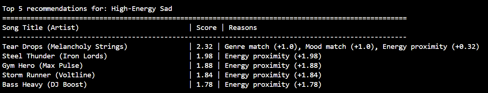

# 🎵 Music Recommender Simulation

## Project Summary

In this project you will build and explain a small music recommender system.

Your goal is to:

- Represent songs and a user "taste profile" as data
- Design a scoring rule that turns that data into recommendations
- Evaluate what your system gets right and wrong
- Reflect on how this mirrors real world AI recommenders

Real-world recommendation engines use complex hybrid systems blending collaborative filtering (user behavior patterns) and content-based filtering (audio features), combined with ranking rules for diversity. This project simulates a foundational **content-based filtering** recommender. It prioritizes matching a user's stated taste profile directly to the acoustic properties and metadata of songs using a custom mathematical scoring rule.

---

## How The System Works

This system uses a content-based approach, calculating a similarity score between a user's ideal preferences and each song's actual attributes. It follows a specific "Algorithm Recipe" based on a balanced weighting strategy:

**1. Input (User Preferences):**
The user provides their target criteria: preferred genre, preferred mood, and target energy level. The system also loads the song database (`songs.csv`).

**2. Process (The Scoring Loop):**
For every single song in the database, the system calculates a matching score starting at 0:
*   **Genre Match:** +2.0 points (acts as a heavy anchor).
*   **Mood Match:** +1.0 point (important, but secondary to genre).
*   **Energy Similarity:** Up to +1.0 point. Calculated using absolute variance: `1.0 - abs(target_energy - song_energy)`.

**3. Output (The Ranking):**
The recommender combines these points into a total score for every song, sorts the catalog in descending order, and returns the top *N* highest-scoring tracks.

### Potential Biases
* **Genre Over-prioritization:** Because genre is weighted so heavily (+2.0), this system might ignore a fantastic song that perfectly matches the user's mood and energy simply because it was labeled with an adjacent or different genre.
* **Lack of Serendipity:** By strictly recommending exactly what the user asks for mathematically, the system creates a content "echo chamber," leaving little room for unexpected discovery.


---

## Getting Started

### Setup

1. Create a virtual environment (optional but recommended):

   ```bash
   python -m venv .venv
   source .venv/bin/activate      # Mac or Linux
   .venv\Scripts\activate         # Windows

2. Install dependencies

```bash
pip install -r requirements.txt
```

3. Run the app:

```bash
python -m src.main
```

### Running Tests

Run the starter tests with:

```bash
pytest
```

You can add more tests in `tests/test_recommender.py`.

---

## Experiments You Tried

Here are the experiments I ran to test the recommender's sensitivity and boundaries:

*   **Testing Adversarial Profiles ("Trick" Inputs):** I created conflicting profiles like "Zero-Energy EDM" and "High-Energy Sad" to see how the system handles contradictions. Initially, because Genre was weighted so heavily (+2.0), the system recommended a very high-energy track for "Zero-Energy EDM" simply because it had an EDM tag. Genre overpowered everything else.
*   **Changing Weights (Halving Genre to +1.0, Doubling Energy to +2.0 max):** To fix the issue above, I reduced genre importance and made energy the deciding factor. 
*   **Results of the Weight Change:** The system traded one bias for another. It became perfectly accurate at matching the "vibe" (energy level), but it started completely ignoring the requested genre. For "Zero-Energy EDM", the new logic recommended a low-energy classical/sad song, missing the point of EDM entirely. 
*   **Takeaway:** This proved that simple additive scoring (just adding points together) is inherently flawed for edge cases. Real recommenders need a mix of strict rules (e.g., "Must filter by EDM first") combined with continuous scoring (e.g., "Sort remaining EDM by energy proximity") to handle contradictory user tastes.

---

## Limitations and Risks

Here are the main limitations and risks associated with this recommender system:

- **Additive Scoring Flaws:** Because it relies on adding points together, the system struggles with contradictory user preferences. It cannot use "hard filters" (e.g., strictly enforcing a specific genre before scoring), meaning a strong match in one area can override a complete mismatch in another.
- **Tiny, Static Catalog:** The simulation relies on a very small dataset (17 songs). Often, the top recommendations are just the "least bad" options available rather than genuinely great matches.
- **Limited Feature Set:** The scoring currently only considers Genre, Mood, and Energy. It ignores other valuable data points available in the dataset (like tempo, valence, and acousticness) and completely lacks understanding of lyrics or cultural context.
- **No Behavioral Data (Pure Content-Based):** The model does not learn from user behavior over time (like skips, replays, or likes), nor does it utilize collaborative filtering to see what similar users are enjoying.
- **The "Echo Chamber" Effect:** By purely optimizing to mathematically match exactly what the user inputs, it leaves no room for serendipity or organically discovering new music outside their boundaries.

---

## Challenge 4: Visual Summary Table Update

The terminal output of the simulation has been updated to use clean ASCII table formatting using Python's built-in string alignment features (no external dependencies like `tabulate` required). When running the system, it prints an aligned, readable table with fixed-width columns for "Song Title", "Score", and "Reasons".

Example output format: 



## Reflection

Read and complete `model_card.md`:

[**Model Card**](model_card.md)

Write 1 to 2 paragraphs here about what you learned:

I learned that recommenders turn data into predictions by translating messy human concepts (like "chill" or "intense") into strict mathematical formulas. Our engine simply awards points for exact label strings and penalizes the numeric difference between requested energy and actual track energy. By ranking these final calculated scores, the algorithm fakes an "understanding" of user preferences, even though it is just sorting rows of simple math output. 

Bias and unfairness slip into these systems incredibly easily through both the dataset and the algorithm logic itself. If a catalog only features extreme high or low energy songs, users who want moderate music are unfairly penalized by the "energy gap" calculation. Furthermore, the reliance on exact text matching ("lofi" vs "chillhop") traps users in filter bubbles. It limits their ability to discover cross-genre artists because the rigid constraints of additive scoring prevent the kind of serendipitous discovery humans naturally excel at.


---

## 7. `model_card_template.md`

Combines reflection and model card framing from the Module 3 guidance. :contentReference[oaicite:2]{index=2}  

```markdown
# 🎧 Model Card - Music Recommender Simulation

## 1. Model Name

**MatchYourVibe**

---

## 2. Intended Use

This model suggests 3 to 5 songs from a small catalog based on a user's preferred genre, mood, and energy level. It is for classroom exploration only, not for real users or real-world products.

---

## 3. How It Works (Short Explanation)

We use a simple math formula to score each song. 
1. If the genre matches exactly, the song gets 1 point.
2. If the mood matches exactly, it gets 1 point.
3. The closer the song's energy is to the user's target energy, the more points it gets (up to 2 points max). 
The songs with the highest total scores win and get recommended first.

---

## 4. Data

The dataset is very small. It only has 17 songs. Each song has acoustic features (like energy and tempo) and text tags (like genre and mood). It does not include lyrics or user listening history. The data mostly covers extreme ends, like very high-energy pop or very quiet classical music.

---

## 5. Strengths

The system works incredibly well for standard, harmonious requests. When a user asks for combinations where genre and energy align naturally (e.g., "Chill Lofi" wanting low energy, or "High-Energy Pop" wanting loud tracks), the simple scoring logic creates highly accurate, convincing recommendations.

---

## 6. Limitations and Bias

The system struggles heavily with contradictory requests (like "Zero-Energy EDM"). Because it uses additive scoring, it might recommend loud club tracks to a user who explicitly wants zero energy, simply because the track had an EDM tag. Furthermore, because of the small dataset, users who want moderate, mid-energy songs are systematically penalized by the math, as most songs in the catalog are on the extremes.

---

## 7. Evaluation

I tested standard profiles like "High-Energy Pop" and trick profiles like "Zero-Energy EDM" to see how the system handles edge cases. I analyzed the terminal output to ensure the explanatory reasons matched the final mathematical score. I also ran automated Python tests (`pytest`) to prove that adjustments to the mathematical weights did not break the scoring logic.

---

## 8. Future Work

If I had more time, I would:
- Use strict filters (e.g., force the system to filter by genre before it applies numeric scores).
- Use more song features, like tempo and danceability, to refine the matches.
- Add fuzzy matching so that words like "chill" and "relaxed" are treated as the same mood.

---

## 9. Personal Reflection

My biggest learning moment was seeing how basic math can create major blind spots when user preferences contradict themselves. I was surprised by how successfully a basic point system can "fake" understanding for standard users, generating what looks like a hand-curated playlist. Building this proved to me that no matter how complex the math gets, human judgment is still absolutely required to classify data fairly, manage edge cases, and design filters that prevent math from doing silly things like recommending loud music for a lullaby playlist!

## Terminal output showing the recommendations (song titles, scores, and reasons)


 
## Terminal Output for Stress Test with Diverse Profiles


