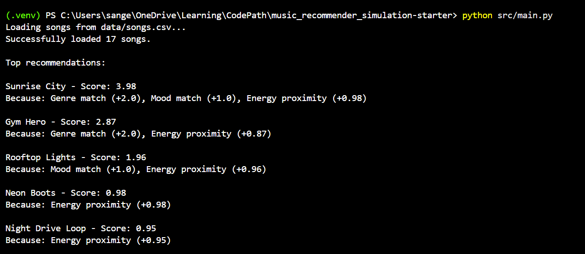
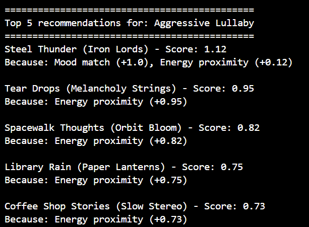
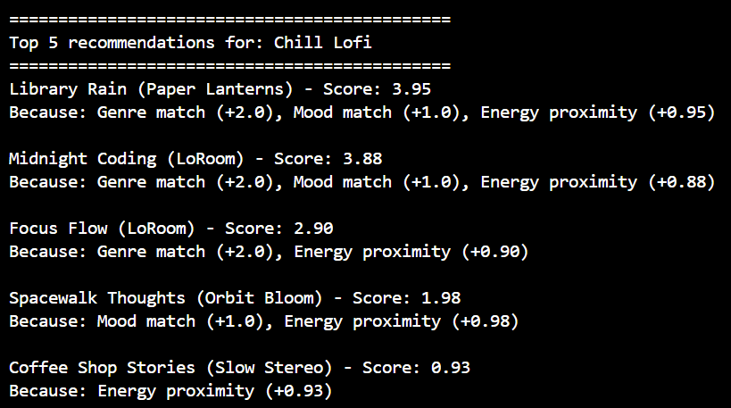
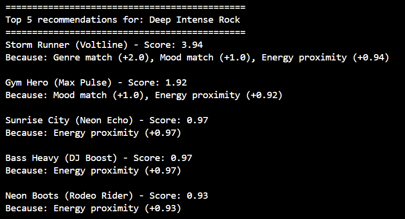
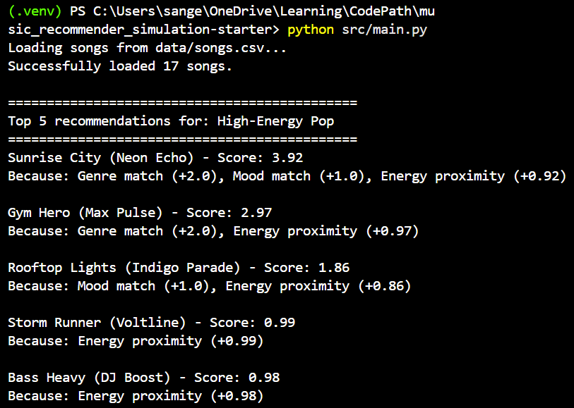
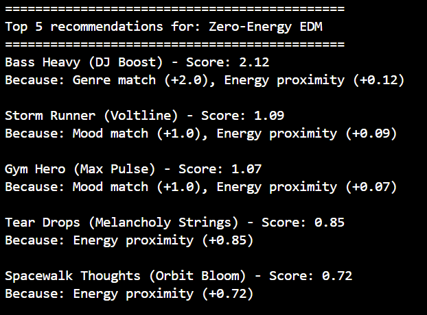
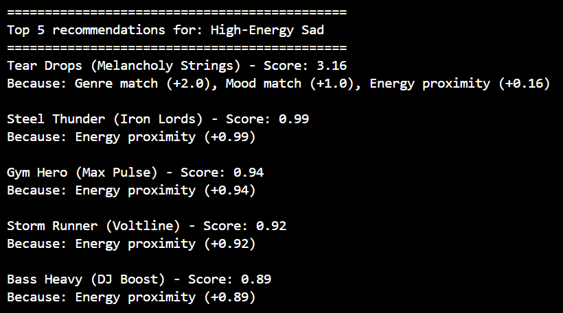

# 🎵 Music Recommender Simulation

## Project Summary

In this project you will build and explain a small music recommender system.

Your goal is to:

- Represent songs and a user "taste profile" as data
- Design a scoring rule that turns that data into recommendations
- Evaluate what your system gets right and wrong
- Reflect on how this mirrors real world AI recommenders

Real-world recommendation engines use complex hybrid systems blending collaborative filtering (user behavior patterns) and content-based filtering (audio features), combined with ranking rules for diversity. This project simulates a foundational **content-based filtering** recommender. It prioritizes matching a user's stated taste profile directly to the acoustic properties and metadata of songs using a custom mathematical scoring rule.

---

## How The System Works

This system uses a content-based approach, calculating a similarity score between a user's ideal preferences and each song's actual attributes. It follows a specific "Algorithm Recipe" based on a balanced weighting strategy:

**1. Input (User Preferences):**
The user provides their target criteria: preferred genre, preferred mood, and target energy level. The system also loads the song database (`songs.csv`).

**2. Process (The Scoring Loop):**
For every single song in the database, the system calculates a matching score starting at 0:
*   **Genre Match:** +2.0 points (acts as a heavy anchor).
*   **Mood Match:** +1.0 point (important, but secondary to genre).
*   **Energy Similarity:** Up to +1.0 point. Calculated using absolute variance: `1.0 - abs(target_energy - song_energy)`.

**3. Output (The Ranking):**
The recommender combines these points into a total score for every song, sorts the catalog in descending order, and returns the top *N* highest-scoring tracks.

### Potential Biases
* **Genre Over-prioritization:** Because genre is weighted so heavily (+2.0), this system might ignore a fantastic song that perfectly matches the user's mood and energy simply because it was labeled with an adjacent or different genre.
* **Lack of Serendipity:** By strictly recommending exactly what the user asks for mathematically, the system creates a content "echo chamber," leaving little room for unexpected discovery.


---

## Getting Started

### Setup

1. Create a virtual environment (optional but recommended):

   ```bash
   python -m venv .venv
   source .venv/bin/activate      # Mac or Linux
   .venv\Scripts\activate         # Windows

2. Install dependencies

```bash
pip install -r requirements.txt
```

3. Run the app:

```bash
python -m src.main
```

### Running Tests

Run the starter tests with:

```bash
pytest
```

You can add more tests in `tests/test_recommender.py`.

---

## Experiments You Tried

Here are the experiments I ran to test the recommender's sensitivity and boundaries:

*   **Testing Adversarial Profiles ("Trick" Inputs):** I created conflicting profiles like "Zero-Energy EDM" and "High-Energy Sad" to see how the system handles contradictions. Initially, because Genre was weighted so heavily (+2.0), the system recommended a very high-energy track for "Zero-Energy EDM" simply because it had an EDM tag. Genre overpowered everything else.
*   **Changing Weights (Halving Genre to +1.0, Doubling Energy to +2.0 max):** To fix the issue above, I reduced genre importance and made energy the deciding factor. 
*   **Results of the Weight Change:** The system traded one bias for another. It became perfectly accurate at matching the "vibe" (energy level), but it started completely ignoring the requested genre. For "Zero-Energy EDM", the new logic recommended a low-energy classical/sad song, missing the point of EDM entirely. 
*   **Takeaway:** This proved that simple additive scoring (just adding points together) is inherently flawed for edge cases. Real recommenders need a mix of strict rules (e.g., "Must filter by EDM first") combined with continuous scoring (e.g., "Sort remaining EDM by energy proximity") to handle contradictory user tastes.

---

## Limitations and Risks

Here are the main limitations and risks associated with this recommender system:

- **Additive Scoring Flaws:** Because it relies on adding points together, the system struggles with contradictory user preferences. It cannot use "hard filters" (e.g., strictly enforcing a specific genre before scoring), meaning a strong match in one area can override a complete mismatch in another.
- **Tiny, Static Catalog:** The simulation relies on a very small dataset (17 songs). Often, the top recommendations are just the "least bad" options available rather than genuinely great matches.
- **Limited Feature Set:** The scoring currently only considers Genre, Mood, and Energy. It ignores other valuable data points available in the dataset (like tempo, valence, and acousticness) and completely lacks understanding of lyrics or cultural context.
- **No Behavioral Data (Pure Content-Based):** The model does not learn from user behavior over time (like skips, replays, or likes), nor does it utilize collaborative filtering to see what similar users are enjoying.
- **The "Echo Chamber" Effect:** By purely optimizing to mathematically match exactly what the user inputs, it leaves no room for serendipity or organically discovering new music outside their boundaries.

---

## Reflection

Read and complete `model_card.md`:

[**Model Card**](model_card.md)

Write 1 to 2 paragraphs here about what you learned:

- about how recommenders turn data into predictions
- about where bias or unfairness could show up in systems like this


---

## 7. `model_card_template.md`

Combines reflection and model card framing from the Module 3 guidance. :contentReference[oaicite:2]{index=2}  

```markdown
# 🎧 Model Card - Music Recommender Simulation

## 1. Model Name

Give your recommender a name, for example:

> VibeFinder 1.0

---

## 2. Intended Use

- What is this system trying to do
- Who is it for

Example:

> This model suggests 3 to 5 songs from a small catalog based on a user's preferred genre, mood, and energy level. It is for classroom exploration only, not for real users.

---

## 3. How It Works (Short Explanation)

Describe your scoring logic in plain language.

- What features of each song does it consider
- What information about the user does it use
- How does it turn those into a number

Try to avoid code in this section, treat it like an explanation to a non programmer.

---

## 4. Data

Describe your dataset.

- How many songs are in `data/songs.csv`
- Did you add or remove any songs
- What kinds of genres or moods are represented
- Whose taste does this data mostly reflect

---

## 5. Strengths

Where does your recommender work well

You can think about:
- Situations where the top results "felt right"
- Particular user profiles it served well
- Simplicity or transparency benefits

---

## 6. Limitations and Bias

Where does your recommender struggle

Some prompts:
- Does it ignore some genres or moods
- Does it treat all users as if they have the same taste shape
- Is it biased toward high energy or one genre by default
- How could this be unfair if used in a real product

---

## 7. Evaluation

How did you check your system

Examples:
- You tried multiple user profiles and wrote down whether the results matched your expectations
- You compared your simulation to what a real app like Spotify or YouTube tends to recommend
- You wrote tests for your scoring logic

You do not need a numeric metric, but if you used one, explain what it measures.

---

## 8. Future Work

If you had more time, how would you improve this recommender

Examples:

- Add support for multiple users and "group vibe" recommendations
- Balance diversity of songs instead of always picking the closest match
- Use more features, like tempo ranges or lyric themes

---

## 9. Personal Reflection

A few sentences about what you learned:

- What surprised you about how your system behaved
- How did building this change how you think about real music recommenders
- Where do you think human judgment still matters, even if the model seems "smart"

## Terminal output showing the recommendations (song titles, scores, and reasons)


 
## Terminal Output for Stress Test with Diverse Profiles








